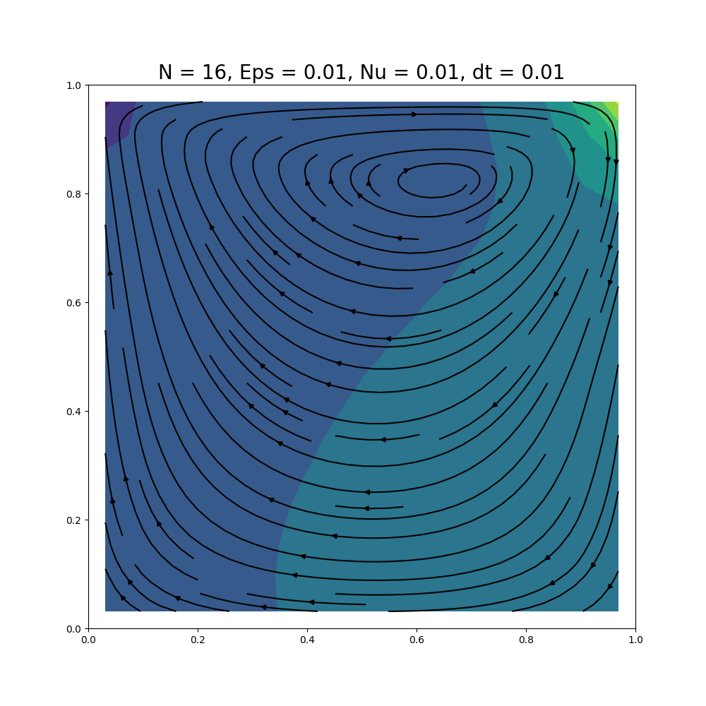

# The Cavern Problem
______________________

Numerical solution for Navier Stokes Equation using SIMPLE (Semi-Implicit Method for Pressure Linked Equations, Patankar & Spalding, 1972) method.
:
Explicit Finite Volume Method

The flow of an incompressible viscous fluid in the unit square $\Omega$ is described by the non-stationary Navier-Stokes equations:

$$\begin{cases}
    \frac{\partial \vec{u}}{\partial t} + (\vec{u}, \nabla) \vec{u} - \nu \Delta \vec{u} + \nabla p = \vec{0} \\
    (\nabla, \vec{u}) = 0
\end{cases}$$

### Boundaries:
The normal velocity components at the boundary are zero. A constant speed $`\mathbf{u}=(1,0)`$ is set on the upper boundary of the region. At the initial time $`\mathbf{u} = 0`$. 

### Example of solution

